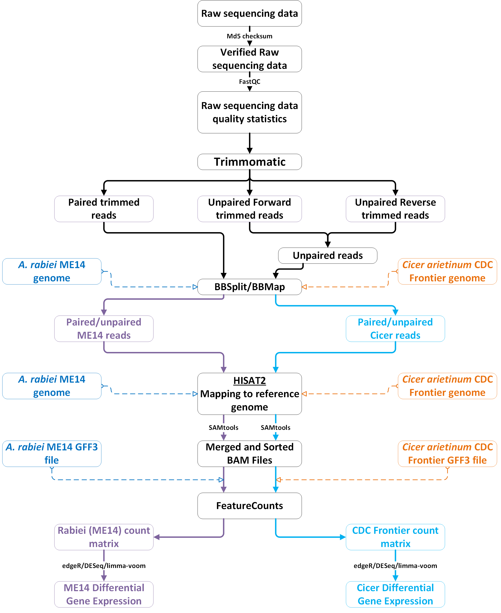

<style type="text/css">

body{/* Normal */
  font-size: 18px;
  font-family: "Corbel";
  }
  
td{/* Table */
  font-size: 14px;
  font-family: "Corbel";
  }

h1.title{
  font-size: 38px;
  font-family: "Corbel";
  color: DarkRed;
  }

h1{/* Header 1 */
  font-size: 28px;
  font-family: "Corbel";
  color: DarkBlue;
  }
  
h2{/* Header 2 */
  font-size: 22px;
  font-family: "Corbel";
  color: DarkBlue;
  }
  
h3{/* Header 3 */
  font-size: 18px;
  font-family: "Book Antigua";
  color: DarkBlue;
  }
code.r{/* Code block */
    font-size: 13px;
    font-family: "Book Antigua";
  }
pre{/* Code block - determines code spacing between lines */
    font-size: 13px;
    font-family: "Book Antigua";
  }
  
pre code.bash {
  background: #B53389;
  font-size: 13px;
  font-family: "Book Antigua";
  }
  
</style>

```{r setup, include=FALSE}
knitr::opts_chunk$set(echo = TRUE)
```

# Genome assembly
Isolates used in this study were collected as part of the GRDC's Australian and international chickpea research. Only Australian isolates were included in this analysis.
Isolates were sequenced using PacBio Single Molecule, Real-Time (SMRT) Sequencing

## Quality assessment
Sequenced reads in FastQ format were quality assessed using <a href="https://www.bioinformatics.babraham.ac.uk/projects/fastqc/" target="_blank">__FASTQC__</a> and the reports compiled using <a href="https://multiqc.info/" target="_blank">__MULTIQC__</a>.

```{r, engine='bash', eval=FALSE}
fastqc -t 16 -o fastqc_reports *.gz ccs_and_bam/*.gz
multiqc -o fastqc_reports/multiqc_report fastqc_reports

```

## Assembly with CANU 2.0

Assembly in  <a href="https://canu.readthedocs.io/en/latest/tutorial.html" target="_blank">CANU 2.0</a> was then accomplished by using a Perl script ,a href="https://github.com/JWDebler/bioinformatics/blob/master/multi_slurmScripts_generator_CANU-2.0.pl" target="_blank">[`multi_slurmScripts_generator_CANU-2.0.pl`]</a> with `--run` option. This script generates sbatch submission script (for <a href="https://slurm.schedmd.com/documentation.html" target="_balnk">SLURM workload manager</a>) for each isolate and `sbatches` them to the `slurm` queue.
At the moment the script will search for FASTA `fna, faa, fasta` and FASTQ `fq.gz, fastq.gz, fastq` file extensions in your input folder to process sbatch scripts. As such, the input directory should contain only your input sequences. 
The `CANU command` around `line 17` of the script can be modified to include more canu options.
The submission scripts should be housed in a folder named `subscripts` inside your defined input directory `my \$inputdir`.

This simple BASH script can accomplish the task albeit slowly!

```{r, engine='bash', eval=FALSE}
#!/usr/bin/env bash
mkdir -p 02-assembly
cd 02-assembly

for f in $(find ../01-datacleaning -name '*.fastq.gz'); do
    id=$(basename $f|cut -f 1 -d '.'| grep -v 'ccs'| sort -u)
    echo This is `canu --version`
    echo Assembly started for isolate $id
    canu \
        -p $id \
        -d $id/CANU2_ASSEMBLY \
        corThreads=6 \
        genomeSize=45m \
        -pacbio-raw ../01-datacleaning/$id.fastq.gz
done

```

## Polishing of genome assemblies

CCS reads were mapped onto the assemblies using <a href="https://github.com/lh3/minimap2" target="_blank">minimap2</a>.
The resulting BAM files were sorted and indexed using <a href="https://github.com/samtools/samtools" target="_blank">samtools</a>. Similarly, Illumina paired-end sequences were  mapped onto the assembled genomes using BWA and the resulting sorted BAM files used to further polish the assemblies using PILON. 

### Running minimap2

```{bash eval=FALSE}

minimap2 -x map-pb -a -t 10 16CUR018.contigs.fasta ../01-datacleaning/ccs_and_bam/16CUR018.ccs.fastq.gz | samtools view -u - | samtools sort -o 16CUR018.ccs.minimap2.bam
samtools index 16CUR018.ccs.minimap2.bam
minimap2 -x map-pb -a -t 10 FT17076-2.contigs.fasta ../01-datacleaning/ccs_and_bam/FT17076-2.ccs.fastq.gz | samtools view -u - | samtools sort -o FT17076-2.ccs.minimap2.bam
samtools index FT17076-2.ccs.minimap2.bam
minimap2 -x map-pb -a -t 10 FT17191-1.contigs.fasta ../01-datacleaning/ccs_and_bam/FT17191-1.ccs.fastq.gz | samtools view -u - | samtools sort -o FT17191-1.ccs.minimap2.bam
samtools index FT17191-1.ccs.minimap2.bam
minimap2 -x map-pb -a -t 10 TR9544.contigs.fasta ../01-datacleaning/ccs_and_bam/TR9544.ccs.fastq.gz | samtools view -u - | samtools sort -o TR9544.ccs.minimap2.bam
samtools index TR9544.ccs.minimap2.bam
minimap2 -x map-pb -a -t 10 TR9571.contigs.fasta ../01-datacleaning/ccs_and_bam/TR9571.ccs.fastq.gz | samtools view -u - | samtools sort -o TR9571.ccs.minimap2.bam
samtools index TR9571.ccs.minimap2.bam
minimap2 -x map-pb -a -t 10 TR9544_me14-enriched.contigs.fasta ../01-datacleaning/ccs_and_bam/bait_miss_TR9544.ccs.fastq.gz | samtools view -u - | samtools sort -o TR9544_me14-enriched.ccs.minimap2.bam && samtools index TR9544_me14-enriched.ccs.minimap2.bam

```

### Running pilon

<a href="https://journals.plos.org/plosone/article?id=10.1371/journal.pone.0112963" target="_blank">PILON</a> was used to polish the CANU assemblies as follows:

```{r, engine='bash', eval=FALSE}
#!/usr/bin/env bash -l
mkdir -p 03-pilon-ccs

for f in $(find 02-assembly -name '*.contigs.fasta' ! -name 'bait_*') do 
	id=$(basename $f|cut -f 1 -d '.')
	echo java -Xmx25G -jar /opt/pilon/current/pilon-1.23.jar \
	--genome $f \
	--pacbio  $id'.ccs.minimap2.bam' \
	--fix all \
	--changes \
	--threads 10 \
	--output 03-pilon-ccs/$id'_pilon.contigs.fna'
done

```

The genome assembly analysis was concluded with a <a href="https://academic.oup.com/bioinformatics/article/31/19/3210/211866" target="_blank">BUSCO</a> and <a href="https://www.ncbi.nlm.nih.gov/pubmed/23422339" target="_blank">QUAST</a> analysis of the pilon-polished assemblies.

## Evaluating the CANU assemblies
### Assessing genome assembly completeness using BUSCO

The **<a href="https://busco.ezlab.org/" target="_blank">BUSCO v4.0.5 docker container</a>** was used to evaluate completeness of the assembled contigs . A simple bash loop script did the trick.


```{r, engine='bash', eval=FALSE}

#!/usr/bin/env bash
docker pull ezlabgva/busco:v4.0.5_cv1
mkdir plot

for genome in *..contigs.fasta; do
    isolate_id=$(basename $genome|cut -f 1 -d '.')
    docker run --user $(id -u):$(id -g) -v $(pwd):/busco_wd ezlabgva/busco:v4.0.5_cv1 busco \
    -i $genome \
    -o $isolate_id \
    -l ascomycota_odb10 \
    -m genome \
    -c 16 \
    -f
    
    cp isolate_id/short_summary.specific.ascomycota_odb10.* plot/. 
done

#ls */.specific.txt | xargs -I {} cp {} plot/.

docker run --user $(id -u):$(id -g) -v $(pwd):/busco_wd ezlabgva/busco:v4.0.5_cv1 generate_plot.py -wd plot -rn `specific`
exit

```

### Assessing genome assembly completeness using QUAST

All assemblies were analysed in quast as follows

```{r, engine='bash', eval=FALSE}
quast.py -r ../../reference_genomes/Ascochyta_rabiei_ME14.fna -g ../../reference_genomes/Ascochyta_rabiei_ME14.gff -t 16  *.fna

```

## Genome annotation and orthology prediction

## GeneMark

I borrowed the nextflow annotation script below from Johannes and ran into a few problems which Johannes had already resolved.

- GeneMark doesn't like spaces or strange characters in FASTA headers. Johannes used `sed -i 's,>,${sampleID}.,g' ${sampleID}.canu.pilon.fna` and `sed -i 's, .*\$,,g' ${sampleID}.canu.pilon.fna`.
- `awk '/^>/{print ">contig" ++i; next}{print}' < inputfile.fna > outputfile.fna` can accomplish the similar results by simply renaming headers as contig-1 to contig-nth.
- GeneMark was updated from v.4.38 to v.4.57 and a new licence was installed.

```{r, engine='bash', eval=FALSE}

#!/usr/bin/env nextflow

params.assemblies = '/ppgdata/fredrick/assembly_data/ascochyta/all_contig_assemblies/best_assemblies/*.fna'
params.outputdir = '/ppgdata/fredrick/assembly_data/ascochyta/FINAL_Assemblies'

params.genemark = '/opt/genemark-ES/gmes_petap.pl'

sequences = Channel
.fromPath(params.assemblies)
.map{ file -> tuple(file.simpleName, file)}
.tap{genomesFordos2unix}

//Making sure there are no strange invisible characters left that would mess with programs down the road
//and also cleaning up fna headers with 'sed', because they contain spaces which mess
//with other tools down the road

process dos2unix {
    tag {sampleID}

    input:
    set sampleID, 'genome.fna' from genomesFordos2unix

    output:
    set sampleID, "${sampleID}.fna" into dos2unixed

    """
    dos2UNIX -n genome.fna ${sampleID}.fna
    """
}

process addSpeciesNameTofnaHeadersContigs {
    tag {sampleID}
    publishDir "${params.outputdir}", mode: 'copy'

    input:
    set sampleID, "${sampleID}.canu.pilon.fna" from dos2unixed

    output:
    set sampleID, "${sampleID}.canu.pilon.fna" into contigsForGenemark

    """
    sed 's,>,>${sampleID}.,g' -i ${sampleID}.canu.pilon.fna
    sed 's, .*\$,,g' -i ${sampleID}.canu.pilon.fna 
    """
}

//GenemarkES annotation
process annotation_genemark {
    tag {sampleID}
    cpus 10
    publishDir "${params.outputdir}", mode: 'copy', pattern: '*.gtf'

    input:
    set sampleID, "${sampleID}.fna" from contigsForGenemark

    output:
    set sampleID, "${sampleID}.canu.pilon.genemark.gtf", "${sampleID}.fna" into genemarkOutput

    """
    ${params.genemark} --ES --fungus --cores ${task.cpus} --sequence ${sampleID}.fna
    mv genemark.gtf ${sampleID}.canu.pilon.genemark.gtf
    """
}

//pull proteins out of genemark annotation
process extractProteinsFromGenemark {
  tag {sampleID}
  publishDir "${params.outputdir}", mode: 'copy', pattern: '*.proteins.fna'

  input:
  set sampleID, "${sampleID}.genemark.gtf", "input.fna" from genemarkOutput

  output:
  set sampleID, "${sampleID}.canu.pilon.genemark.proteins.fna" into proteinsFromGenemark

  """
  /opt/genemark-ES/get_sequence_from_GTF.pl ${sampleID}.genemark.gtf input.fna
  mv prot_seq.faa ${sampleID}.canu.pilon.genemark.proteins.fna
  """
}

```

## panTE

I used Darcy’s <a href="https://github.com/darcyabjones/pante" target="_blank">panTE</a> pipeline to do repeat, transposable element, and RNA prediction and annotation on the best assemblies.
First I obtained panTE: 

```git clone https://github.com/darcyabjones/pante```

The copied the  <a href="https://www.girinst.org/server/RepBase/index.php" target="_blank">RepBase repeat masker formatted database</a> already downloaded: 

```cp /ppgdata/johannes/panTE/Rep*.tar.gz .``` 

And finally ran the nextflow pipeline to annotate the assemblies.

```{r, engine='bash', eval=FALSE}
nextflow run pante/main.nf -profile docker –resume --genomes "../*.canu.pilon.fna" --repbase RepBaseRepeatMaskerEdition-20181026.tar.gz --rm_meta RepeatMaskerMetaData-20181026.tar.gz --rm_species Ascochyta --species fungi –rnammer

```

## Augustus


# Comparative analysis using OrthoFinder
Protein sequences from all genomes were clustered into potential orthologs using <a href="https://github.com/davidemms/OrthoFinder" target="_blank">OrthoFinder v.2.4.0</a>

## Running OrthoFinder

```{r, engine='bash', eval=FALSE}
orthofinder -f genomes -t 16 -S diamond -M msa -a 10 -o ./orthofinder_results

```

# RNA-seq data anaysis
## Workflow

The data pre-processing and analysis pipeline is summarised below.


# QC on raw sequencing data
All raw files in FASTQ format were analysed using <a href="https://www.bioinformatics.babraham.ac.uk/projects/fastqc/" target="_blank">FastQC v0.11.9</a> and the results were compiled into a single reports using <a href="https://multiqc.info/" target="_blank">MultiQC</a>.
The reads were then quality-trimmed using trimmomatic v0.3.9
The trimmed reads were also assessed for post-QC quality using FastQC v0.11.9 as before.

```{r, engine='bash', eval=FALSE}
#usr/bin/bash -l
fastqc -t 16 -o fastqc_raw *.fq.gz
multiqc -s -i 'Quality assessment of raw AGRF RNAseq data' -o multiqc_raw_report -ip -v ./fastqc_raw

for fq in `ls *.fq.gz| rev| cut -f2- -d\_| sort -u| rev`; do 
  echo -e "java -jar ~/Trimmomatic-0.39/trimmomatic-0.39.jar \
  PE -threads 16 -phred33 \
  "$fq"_R1.fq.gz "$fq"_R2.fq.gz \
  -baseout ../02_processed_data/trimmomatic/"$fq"_trimmo.fq.gz \
  SLIDINGWINDOW:4:20 \MINLEN:36 LEADING:6 TRAILING:6 ILLUMINACLIP:TruSeq3-PE.fa:3:30:10 > "$fq".trim.log 2>&1" ; done > trimmomatic.sh

parallel < trimmomatic.sh

tail -n 1 *.trim.log | grep 'Completed successfully' | wc -l && ls *.log | wc -l ## Trimmomatic command completion

fastqc -t 10 -o ../02_processed_data/trimmomatic/fastqc_trimmo/ ../02_processed_data/trimmomatic/*.gz
cd ../02_processed_data/trimmomatic/fastqc_trimmo/
multiqc -s -i 'Quality assessment of trimmed AGRF RNAseq data' -o multiqc_trim_report -ip -v .

```

Due to the polyG problem in almost all reverse `*_R2.fq.gz` reads, which was not resolved upon the initial quality-based trimming and adaptors removal, I included the following sequences into a copy of the file `Truseq2-PE.fa` and re-did the trimmomatic analysis.

The QC report for trimmed samples can be viewed <a href="2020-10-06_RNAseq_analysis/fastqc_trimmo/multiqc_trim_report/Quality-assessment-of-trimmed-AGRF-RNAseq-data_multiqc_report.html" target="_blank">here</a>

```{r, engine='bash', eval=FALSE}
>p-A
AAAAAAAAAAAAAAAAAAAAAAAAAAA
>p-T
TTTTTTTTTTTTTTTTTTTTTTTTTTT
>p-G
GGGGGGGGGGGGGGGGGGGGGGGGGGG

```

# Run BBsplit using ME14 and Cicer_arietinum_AR102_ASM33114v1 references
Reads were separated according to their predicted origin

```{r, engine='bash', eval=FALSE}

cd /mnt/data/02_processed_data/trimmomatic

for fq in `cat samples.txt`; do
  if [ -e "$fq"_unpaired.fq.gz ]; then
		cat "$fq"_trimmo_1U.fq.gz "$fq"_trimmo_2U.fq.gz \> "$fq"_unpaired.fq.gz
  	rm "$fq"_trimmo_1U.fq.gz "$fq"_trimmo_2U.fq.gz
  else
    echo Concatenated unpaired file for isolate: "$fq" already exists
  	continue
  fi
  
	echo ~/bbmap/bbsplit.sh in1="$fq"_trimmo_1P.fq.gz in2="$fq"_trimmo_2P.fq.gz \
	ref=ME14.fna,Cicer_arietinum_AR102_ASM33114v1.fna \
	ambiguous=toss ambiguous2=toss \
	maxindel=100000 \
	basename="$fq"_%_#.fq.gz \
	refstats="$fq"_p.log;
	echo ~/bbmap/bbsplit.sh in="$fq"_unpaired.fq.gz \
	ref=ME14.fna,Cicer_arietinum_AR102_ASM33114v1.fna \
	ambiguous=toss ambiguous2=toss \
	maxindel=100000 \
	basename="$fq"_unpaired_%.fq.gz \
	refstats="$fq"_u.log;
done > run_bbsplit.sh

```

# Assembly and quantification of fungal reads into transcript counts

## Hisat2 mapping

```{r, engine='bash', eval=FALSE}
for f in `cat samples.txt`; do
	fastq=$(basename $f);
	echo hisat2 \
	-x /mnt/data/reference_genomes/ME14/ME14 \
	--rna-strandness FR \
	--no-spliced-alignment \
	-q \
	-t \
	-p 16 \
	'--dta' \
	'--new-summary' \
	'--summary-file' $fastq'_vs_ME14.sam.log' \
	-1 $fastq'_trimmo_1P.fq.gz' \
	-2 $fastq'_trimmo_2P.fq.gz' \
	-U $fastq'_unpaired.fq.gz' \| \
	samtools view -\@ 16 -bS - \| \
	samtools sort -\@ 16 -O BAM -o $fastq"_vs_ME14.bam";
	echo samtools index $fastq"_vs_ME14.bam";
	echo
done

```

## Run stringtie

```{r, engine='bash', eval=FALSE}
for i in *.bam; do 
  stringtie $i -v -p 16 -e -o ${i/.bam/.hisat2.gtf} \
  -G ../../reference_genomes/ME14.gtf \
  -A ${i/.bam/.hisat2.ga} \
  -l ${i/.bam/_stringtie} 
done
```


```{r, engine='bash', eval=FALSE}

for i in `cat samples.txt`; do 
  ../../01_raw_data/GEMmaker/bin/hisat2_fpkm_tpm.sh true $i ME14 false true
done

```

## Join the raw files into matrix

```{r, engine='bash', eval=FALSE}
awk -v j=1 '{key=$j; $j=""}  # get key and delete field j
                         (NR==FNR){order[FNR]=key;} # store the key-order
                         {entry[key]=entry[key] OFS $0 } # update key-entry
                         END { for(i=1;i<=FNR;++i) {
                                  key=order[i]; print key entry[key] # print
                               }
                         }' *.raw > ME14_vs_samples.RAW.Counts.txt.manualProcessing
                         
alias dos2unix="sed -i -e 's/'\"\$(printf '\015')\"'//g' "
dos2unix ME14_vs_samples.RAW.Counts.txt.manualProcessing

```


On a separate analysis, samples were processed using an existing gene expression sample processing nextflow workflow (<a href="https://github.com/SystemsGenetics/GEMmaker" target="_blank">GEMmaker</a>) as follows: 

+ `nextflow run GEMmaker/main.nf -resume -profile standard`

# DGE matrix analysis

```{r, eval=FALSE}
raw.counts <- read.delim("2020-10-06_RNAseq_analysis/ME14_vs_samples.RAW.Counts.txt", 
                         check.names = F, row.names = 1)
exper_setup <- read.delim("2020-10-06_RNAseq_analysis/metadata.tsv", check.names = F)

## check sample names bewteen counts and experimental setup
setdiff(names(raw.counts),exper_setup$SampleName)

counts <- raw.counts[, exper_setup$SampleName] ## reorder counts columsn based on the experimental setup 

m <- data.matrix(counts[, 1:ncol(counts)])# convert readcount table to matrix
tibble(exper_setup, width = 10) %>% 
  rmarkdown::paged_table(.)

exper_setup$Group <- gsub("-", "", exper_setup$Group)

```

## Raw counts are converted to CPM
```{r, eval=FALSE}
cpm <- apply(m,2, function(x) (x/sum(x))*1000000) ## Calculate CPM from raw counts to normalize for different sequencing depth for each sample
m1 <- m[rowSums(cpm < 1) <= 174, ] ## remove any genes with a CPM of less than 1 across all samples

```

## Further Processing

Differentially Expressed Genes were determined independently using <a href="http://bioconductor.org/packages/release/bioc/vignettes/DESeq2/inst/doc/DESeq2.html" target="_blank">DESeq</a> and <a href="https://ucdavis-bioinformatics-training.github.io/2018-June-RNA-Seq-Workshop/thursday/DE.html" target="_blank">Limma-voom</a> protocols in R. DEGs were selected based on Log<sub>10</sub> Fold Change ≥ |2| and a False Discovery Rate (FDR) ≤ 0.01 (Benjamini-Hochberg procedure).

Using the  We analysed the data through using DESeq to see if we can replicate the DEG's identified using limma-voom


# Session information
This script was last updated on:

```{r echo=FALSE}
cat(as.character(format(Sys.time(), "%a %d %b %Y, %H:%M:%S")))

```

................... THE END ......................

<span style="color:DarkBlue; font-size:9px;">
  Author: <a href="https://staffportal.curtin.edu.au/staff/profile/view/fredrick-mobegi-3e2213de/" target="_blank">Fredrick M. Mobegi, PhD</a><br/>
  Created: 07-12-2020 Mon 07:00<br/>
  Copyright &copy; 2020 Fredrick Mobegi | This notebook is for reference purposes only and may contain links to embargoed or legally privileged data.
</span>

